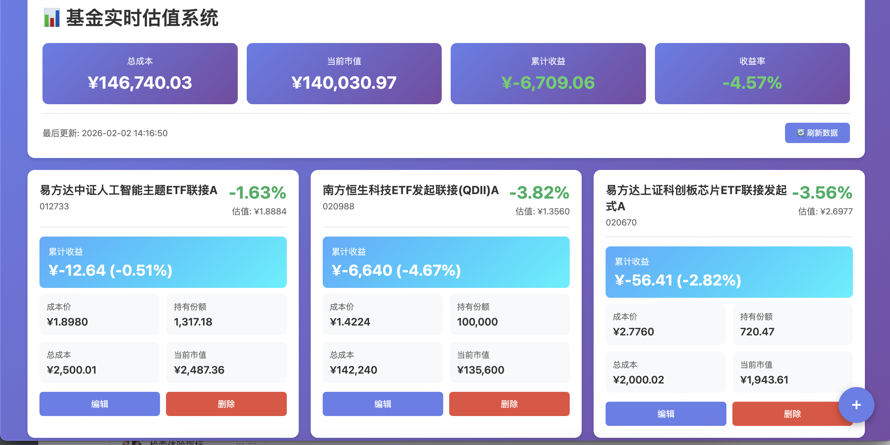

# 基金实时估值系统

一个基于 Flask + AKShare 的基金实时估值服务，支持添加基金、显示收益、自动刷新估值数据。



## 功能特性

✅ **实时估值** - 使用 AKShare 获取基金实时估值数据  
✅ **收益计算** - 自动计算持仓成本、当前市值、累计收益  
✅ **自动刷新** - 后台每60秒自动更新一次数据  
✅ **数据持久化** - 服务重启后自动加载历史数据  
✅ **美观界面** - 现代化的响应式UI设计  
✅ **CRUD操作** - 支持添加、编辑、删除基金

## 快速开始

### 1. 安装依赖

```bash
pip install -r requirements.txt
```

### 2. 启动后端服务

```bash
python fund_service.py
```

启动成功后，你会看到：

```
============================================================
🚀 基金实时估值服务启动中...
============================================================
✅ 加载了 0 个基金持仓
📊 正在初始化缓存数据...
⏰ 启动后台自动更新线程（每60秒）...
============================================================
✅ 服务已启动！
📍 API地址: http://localhost:5000
============================================================
```

### 3. 打开前端页面

直接用浏览器打开 `fund_frontend.html` 文件即可。

## API 文档

### 1. 获取所有基金

```http
GET /api/funds
```

**响应示例：**
```json
{
  "success": true,
  "data": [
    {
      "id": 1,
      "code": "020988",
      "name": "南方恒生科技ETF发起联接(QDII)A",
      "cost_price": 1.4098,
      "shares": 10000,
      "estimated_value": 1.3620,
      "estimated_change_rate": "-3.39%",
      "total_cost": 14098.00,
      "current_value": 13620.00,
      "profit": -478.00,
      "profit_rate": -3.39
    }
  ],
  "update_time": "2026-02-02 15:30:00",
  "total_count": 1
}
```

### 2. 添加基金

```http
POST /api/funds/add
Content-Type: application/json

{
  "code": "020988",
  "name": "南方恒生科技",
  "cost_price": 1.4098,
  "shares": 10000
}
```

### 3. 更新基金

```http
PUT /api/funds/update/<fund_id>
Content-Type: application/json

{
  "cost_price": 1.5000,
  "shares": 15000
}
```

### 4. 删除基金

```http
DELETE /api/funds/delete/<fund_id>
```

### 5. 获取汇总信息

```http
GET /api/summary
```

**响应示例：**
```json
{
  "success": true,
  "data": {
    "total_cost": 50000.00,
    "total_value": 52500.00,
    "total_profit": 2500.00,
    "total_profit_rate": 5.00,
    "fund_count": 3
  }
}
```

### 6. 手动刷新数据

```http
POST /api/refresh
```

## 使用示例

### 添加你的第一个基金

1. 点击页面右下角的 **+** 按钮
2. 输入基金信息：
   - 基金代码：`020988`
   - 成本价：`1.4098`
   - 持有份额：`10000`
3. 点击"添加"按钮

系统会自动：
- 从 AKShare 获取基金名称和实时估值
- 计算当前市值和收益
- 保存到本地 JSON 文件

### 查看收益

首页会显示：
- 📊 总成本：所有基金的总投入
- 💰 当前市值：基于实时估值的总市值
- 💵 累计收益：当前市值 - 总成本
- 📈 收益率：累计收益 / 总成本 × 100%

每个基金卡片显示：
- 实时估值和涨跌幅（红涨绿跌）
- 成本价、持有份额、总成本
- 当前市值、累计收益、收益率

### 编辑持仓

点击基金卡片上的"编辑"按钮，可以修改：
- 成本价（如加仓/减仓后的新成本）
- 持有份额

### 数据刷新

- **自动刷新**：后台每60秒自动更新一次
- **手动刷新**：点击页面顶部的"🔄 刷新数据"按钮

## 数据文件

所有数据保存在 `fund_data.json` 文件中：

```json
[
  {
    "id": 1,
    "code": "020988",
    "name": "南方恒生科技",
    "cost_price": 1.4098,
    "shares": 10000,
    "add_time": "2026-02-02 15:00:00"
  }
]
```

服务重启后会自动加载这个文件。

## 技术栈

**后端：**
- Flask - Web框架
- AKShare - 金融数据获取
- Threading - 后台定时任务

**前端：**
- 原生 HTML/CSS/JavaScript
- Fetch API - 异步请求
- 响应式设计

## 注意事项

1. **数据来源**：使用 AKShare 的 `fund_value_estimation_em` 接口，数据来自东方财富网
2. **更新频率**：建议不要设置太高的刷新频率，避免请求过于频繁
3. **基金类型**：当前仅支持"混合型"基金，如需其他类型可修改代码
4. **网络要求**：需要能访问东方财富网API

## 扩展建议

想要添加更多功能？可以考虑：

- 📊 添加历史收益曲线图
- 📱 适配移动端APP
- 🔔 设置涨跌提醒（邮件/微信）
- 📈 支持股票、指数等其他品种
- 💾 使用数据库替代JSON文件
- 🔐 添加用户登录和多账户支持

## 常见问题

**Q: 为什么有的基金显示"---"？**  
A: 可能该基金代码不在混合型基金列表中，或者基金当天停牌。

**Q: 估值数据准确吗？**  
A: 估值数据来自东方财富网，仅供参考，实际以基金公司公布为准。

**Q: 如何备份数据？**  
A: 直接复制 `fund_data.json` 文件即可。

**Q: 服务崩溃怎么办？**  
A: 数据保存在JSON文件中，重启服务即可恢复。


**免责声明**：本系统仅供学习和参考，不构成投资建议。投资有风险，入市需谨慎。
